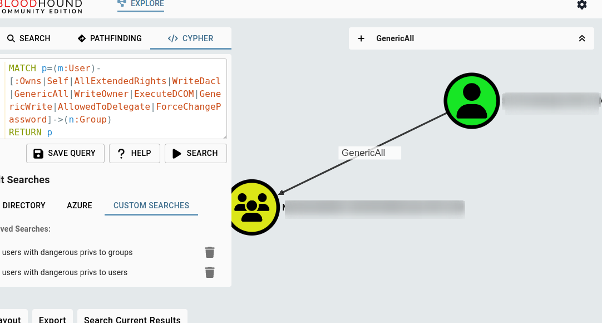
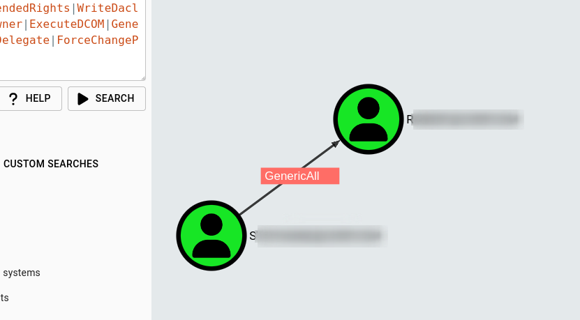

# Cypher queries

## Domain users with dangerous privileges to domain groups.
```
MATCH p=(m:User)-[:Owns|Self|AllExtendedRights|WriteDacl|GenericAll|WriteOwner|ExecuteDCOM|GenericWrite|AllowedToDelegate|ForceChangePassword]->(n:Group)
RETURN p
```



## Domain users with dangerous privileges to other domain users
```
MATCH p=(m:User)-[:Owns|Self|AllExtendedRights|WriteDacl|GenericAll|WriteOwner|ExecuteDCOM|GenericWrite|AllowedToDelegate|ForceChangePassword]->(n:User)
RETURN p
```

